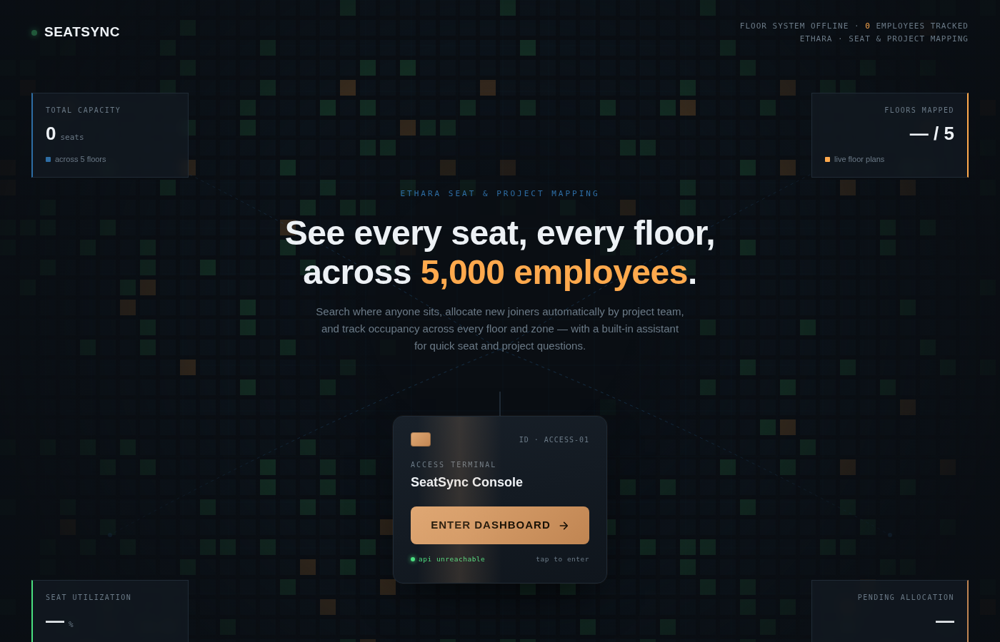
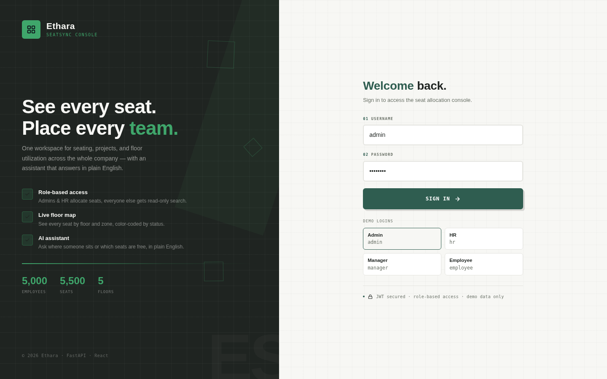
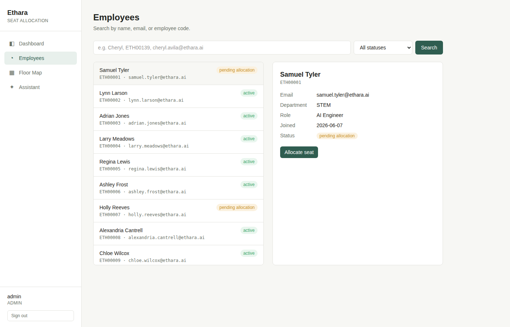
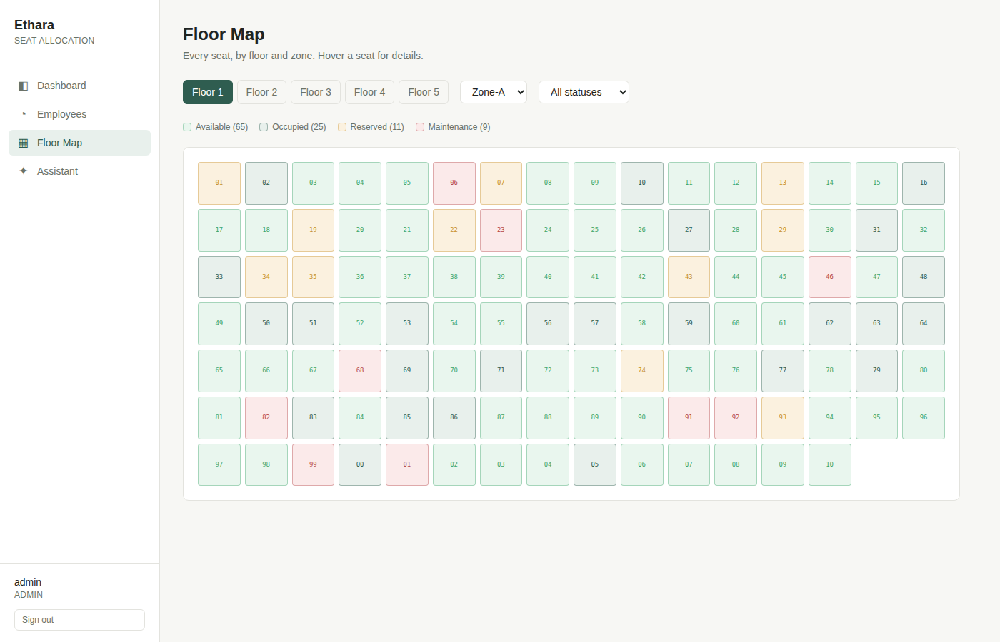
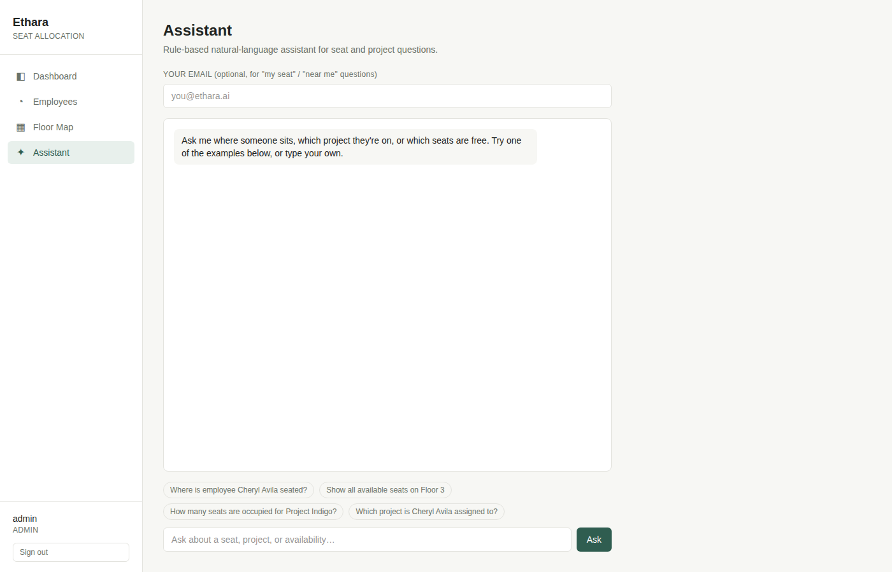

# Ethara Seat Allocation & Project Mapping System

Full-stack app for managing seat allocation across ~5,000 employees: employee management, project mapping, seat allocation/release, new-joiner allocation, search, a stats dashboard, and a natural-language AI assistant.

---

## Live URLs

- **Frontend (Vercel):** `https://ethara-seat-allocation-project-mapp.vercel.app/`
- **Backend (Railway):** `https://ethara-seat-allocation-project-mapping-system-production.up.railway.app`
- **Swagger / API Docs:** `https://ethara-seat-allocation-project-mapping-system-production.up.railway.app/docs`

---

## Stack

- **Backend:** Python, FastAPI, SQLAlchemy 2.0, Pydantic v2
- **Database:** SQLite for local/demo; production-ready for PostgreSQL by swapping the `DATABASE_URL` environment variable.
- **Frontend:** React 19 + Vite + Tailwind v4 + React Router 7
- **AI Assistant:** Rule-based intent parser (offline, no API key needed), designed so a real LLM call (Claude / OpenAI / Gemini) can be dropped in on top of the same intent handlers.

---

## Project Structure

```text
backend/
  app/
    main.py            # FastAPI app + router registration + CORS
    database.py        # DB engine/session (SQLite by default, DATABASE_URL for Postgres)
    models.py          # SQLAlchemy models: Employee, Project, Seat, SeatAllocation, User
    schemas.py         # Pydantic request/response schemas
    auth.py            # JWT creation/validation, password hashing, role-based dependencies
    seed.py            # Seed data generator (5000 employees, 5500 seats, etc.)
    routers/
      auth.py          # JWT login, current user endpoint, user management
      employees.py     # CRUD + search        -> /employees
      projects.py      # CRUD + list employees by project -> /projects
      seats.py         # CRUD, /available, /allocate (proximity logic), /release -> /seats
      dashboard.py     # /summary, /project-utilization, /floor-utilization -> /dashboard
      ai.py            # POST /ai/query natural-language assistant -> /ai
  requirements.txt
frontend/
  src/
    pages/             # Landing, Dashboard, Employees, Seats, Assistant
    components/        # Sidebar, StatCard
    api.js             # fetch wrapper, base URL from VITE_API_URL
AI_PROMPTS.md          # Prompt-by-prompt log of how this project was built with AI
```

---

## Authentication & Role-Based Access Control (RBAC)

The backend implements JWT-based authentication with 4 roles: **admin**, **hr**, **manager** (project lead), and **employee**. This is enforced on the API level (returning 403 Forbidden for unauthorized actions).

| Role     | Read (search/dashboard/AI) | Create/update/deactivate employees | Allocate/release seats | Create projects/seats | Manage users |
|----------|:---:|:---:|:---:|:---:|:---:|
| admin    | ✅ | ✅ | ✅ | ✅ | ✅ |
| hr       | ✅ | ✅ | ✅ | ❌ | ❌ |
| manager  | ✅ | ❌ | ❌ | ❌ | ❌ |
| employee | ✅ | ❌ | ❌ | ❌ | ❌ |

### Sample Credentials (Created by `python -m app.seed`):

| Username | Password    | Role     |
|----------|-------------|----------|
| admin    | admin123    | admin    |
| hr       | hr123       | hr       |
| manager  | manager123  | manager  |
| employee | employee123 | employee (linked to a real employee record) |

### API Auth Flow:
1. Authenticate via `POST /auth/login` (form-encoded `username` / `password`).
2. Returns `{access_token, role, username, employee_id}`.
3. Send `Authorization: Bearer <token>` in subsequent HTTP request headers.
4. `GET /auth/me` returns details of the current logged-in user.
5. `POST /auth/users` (admin-only) allows creating additional user logins.

*Note: Set `JWT_SECRET_KEY` as an environment variable in production; the code falls back to a development-only default locally.*

---

## Running Locally

### Backend

```bash
cd backend
pip install -r requirements.txt
python -m app.seed        # generates seed data into ethara_seats.db
uvicorn app.main:app --reload
```

- Visit `http://localhost:8000/docs` for interactive Swagger API docs.
- Visit `http://localhost:8000/health` for a liveness check.

### Frontend

```bash
cd frontend
npm install
npm run dev               # http://localhost:5173, expects backend at http://localhost:8000
```

- Set `VITE_API_URL` in `frontend/.env` if the backend runs elsewhere (e.g., the Railway URL in production).

---

## Frontend Screens & Screenshots

Built with React, Vite, and Tailwind v4. The interface includes five main screens:

### 1. Landing Page (`/`)
SeatSync-branded splash page with live stats (real employee/seat counts, utilization, pending allocations pulled from `/dashboard/summary`), an animated seat-grid background whose color mix reflects the occupied/available/reserved ratio, and an “Enter Dashboard” button that routes into the app.



### 2. Login Page (`/login`)
Role-based demo account selections for easy login (Admin, HR, Manager, Employee).



### 3. Dashboard (`/dashboard`)
KPI cards (each clickable, linking to a filtered Employees/Seats view), floor occupancy bars, and a project utilization table built from `/dashboard/summary`, `/dashboard/project-utilization`, and `/dashboard/floor-utilization`.


### 4. Employees (`/employees`)
Search by name/email/employee code, view detail, and allocate/release seats for employees. *(Note: Actions are authorized based on user role).*



### 5. Floor Map (`/seats`)
Seating grid: pick a floor + zone to see every seat color-coded by status (available/occupied/reserved/maintenance) in a grid, with hover detail for seat number and bay. Or filter by status to get a paginated cross-floor list instead.



### 6. AI Assistant (`/assistant`)
Chat UI against `POST /ai/query`, with example prompts and an optional email field for “my seat” / “who’s near me” questions.



---


## API Reference

All routes are mounted with the prefixes below (see `main.py`); full interactive docs are always available at `/docs`.

### Auth — `/auth`

| Method | Path | Description |
| --- | --- | --- |
| POST | `/auth/login` | Login with username and password, returns access token |
| GET  | `/auth/me` | Get currently logged-in user profile |
| POST | `/auth/users` | Create a new user login (Admin only) |

### Employees — `/employees`

| Method | Path | Description |
| --- | --- | --- |
| POST | `/employees` | Create employee (rejects duplicate email/code) (Admin/HR only) |
| GET  | `/employees` | List/search employees (query params, `limit`/`offset`) |
| GET  | `/employees/{employee_id}` | Get one employee |
| PUT  | `/employees/{employee_id}` | Update employee (Admin/HR only) |
| DELETE | `/employees/{employee_id}` | Deactivate employee (204) (Admin/HR only) |

### Projects — `/projects`

| Method | Path | Description |
| --- | --- | --- |
| POST | `/projects` | Create project (Admin only) |
| GET  | `/projects` | List all projects |
| GET  | `/projects/{project_id}/employees` | List employees on a project |

### Seats — `/seats`

| Method | Path | Description |
| --- | --- | --- |
| POST | `/seats` | Create seat (rejects duplicate seat number on same floor/zone) (Admin only) |
| GET  | `/seats` | List seats, filterable by `floor`, `zone`, `status` |
| GET  | `/seats/available` | List available seats, filterable by `floor`, `zone` |
| POST | `/seats/allocate` | Allocate a seat to an employee (proximity logic) (Admin/HR only) |
| POST | `/seats/release` | Release an employee's active seat back to `available` (Admin/HR only) |

### Dashboard — `/dashboard`

| Method | Path | Description |
| --- | --- | --- |
| GET | `/dashboard/summary` | Total employees/seats, occupied/available/reserved counts, pending allocations |
| GET | `/dashboard/project-utilization` | Seats occupied per project |
| GET | `/dashboard/floor-utilization` | Occupancy % per floor |

### AI Assistant — `/ai`

| Method | Path | Description |
| --- | --- | --- |
| POST | `/ai/query` | Natural-language query, see below |

### Misc

| Method | Path | Description |
| --- | --- | --- |
| GET | `/` | `{"status": "ok", "docs": "/docs"}` |
| GET | `/health` | `{"status": "healthy"}` |

---

## Seed Data

`python -m app.seed` generates:
- **5,000 employees** across **5 departments** with fixed headcounts:
  - Research & Development (25)
  - Growth — HR/Finance/People roles (100)
  - Technical (1,500)
  - STEM (2,000)
  - Non-STEM (remainder, ~1,375)
- **19 projects** grouped by department:
  - Research & Development (1)
  - Growth (1)
  - Technical — Kaiju, Vindex, Talos, Leviathan, Gohan, Vajeta, Yeager, Valkarie (8)
  - STEM — Skyforge, Fenrir, Valor (3) (Skyforge and Fenrir are the largest teams)
  - Non-STEM — Text-to-Image Compare, Omni-ELO, Multimodal Annotation, Rubric Design, Dialogue Evaluation, Data Labeling Ops (6, named after Ethara's real RLHF/evaluation service lines)
- **5 floors x 10 zones x 110 seats = 5,500 seats**, with **Floor 1 as a dedicated leadership floor**:
  - Zone-A is the R&D team's area (open-plan)
  - Zone-B is the Growth team's area (open-plan)
  - 30 individual cabins for a promoted pool of Technical/STEM/Non-STEM staff (with titles like CEO, CFO, CTO, Manager, Senior Manager)
  - 15 meeting-room seats and 25 waiting-area seats (facility space, marked `reserved`)
  - All sharing the same 1,100-seat floor total as every other floor.
- **Floors 2–5** keep fixed occupied targets (1053/888/969/730) for the remaining individual-contributor population.
- **4 sample login users**, one per role (see Authentication section).

---

## Known Bugs Fixed Along the Way

- **Seat-numbering gaps**: An earlier version of the seed script renamed cabin/R&D seats to `CAB-xxx`/`RD-xxx`, which pulled them out of each zone's sequential numbering and left visible gaps (e.g., `A1-010` missing). Fixed: seats always keep their original sequential number; only the `bay` field changes to indicate room type.
- **`/dashboard/project-utilization` cross-join bug**: Joining `Employee` and `SeatAllocation` to `Project` independently (not to each other) produced a Cartesian product, so a project's reported occupied-seat count was actually `real_allocations × employee_count` (one project showed "596,750 seated" instead of 682). Fixed with a `.distinct()` on the allocation count.
- **passlib + bcrypt incompatibility**: `passlib`'s bcrypt backend raises `AttributeError: module 'bcrypt' has no attribute '__about__'` / `password cannot be longer than 72 bytes` against bcrypt>=4.1, a known unresolved upstream compatibility break. Fixed by calling `bcrypt` directly (`hashpw`/`checkpw`) instead of going through `passlib`.

---

## Seat Allocation Logic (Proximity)

`POST /seats/allocate` with just `employee_id`:
1. Uses `preferred_zone` if passed.  
2. Otherwise finds the zone where the most active teammates on the same project already sit (`_find_best_zone_for_project` in `seats.py`) and allocates there.  
3. Falls back to any available seat in any zone if the preferred/team zone has none free.

The endpoint rejects the request with `400` if the employee already has an active allocation.

---

## AI Assistant

`POST /ai/query` with `{"query": "...", "email": "optional@ethara.ai"}` handles:
- “Where is employee X seated?” / “Where is my seat?” (with email).  
- “Which project is X assigned to?”  
- “Show available seats on Floor N.”  
- “How many seats are occupied for Project X?”.  
- “Who is sitting near me?” (with email).  
- Guidance on allocating a seat for a new joiner.

The assistant uses a deterministic keyword/regex intent parser that works fully offline and is easy to demo without any external API dependency. A real LLM (Claude / OpenAI) can be layered on top to handle free-form phrasing the rules miss, using the same underlying data-fetch functions (`_find_employee`, `_employee_seat_answer`, etc. in `ai.py`).

---

## Business Rules Enforced

- One employee → one active seat allocation (enforced in `/seats/allocate`).  
- One seat → one active employee (seat marked `occupied` on allocation).  
- Released seats return to `available`.  
- Duplicate employee email rejected.  
- Duplicate seat number on same floor/zone rejected.

---

## Assessment Mapping

This section maps assessment requirements to concrete features and endpoints.

- **Employee Management:** `routers/employees.py` with full CRUD + search; **Employees** page (`/employees`) for HR/Admin to manage employee records.  
- **Project Mapping:** `routers/projects.py` with project CRUD and `GET /projects/{project_id}/employees` to list employees per project; seed data distributing 5,000 employees over 10 projects.  
- **Seat Allocation & Release:** `routers/seats.py` with allocation, release, availability, and filtered seat lists; Floor Map (`/seats`) visualizes seat states by floor/zone.  
- **New Joiner Seat Allocation:** ~150 employees seeded with no active seats; `/dashboard/summary` exposes pending allocations, and AI assistant plus `/seats/allocate` provide guided seat assignment for new joiners.  
- **Search & Filter:** search by name/email/code on `/employees`, plus query‑param search in `GET /employees`; filters for floor/zone/status in `GET /seats` and `GET /seats/available`.  
- **Dashboard & Analytics:** `/dashboard/summary`, `/dashboard/project-utilization`, `/dashboard/floor-utilization` power the Dashboard page with KPIs, occupancy bars, and project utilization.  
- **AI Assistant / Natural Language:** `POST /ai/query` and the `/assistant` page provide an NL interface to seat location, project assignment, availability, utilization, and “near me” queries.  
- **REST APIs:** FastAPI app in `main.py` mounts routers for employees, projects, seats, dashboard, AI, and misc; Swagger docs at `/docs`.  
- **Seed Data Generation:** `python -m app.seed` script generates full dataset for 5,000 employees and 5,500 seats with realistic status distribution and pending allocations.  
- **Tech Stack & Deployment:** Backend on Railway, frontend on Vercel, database ready for PostgreSQL via `DATABASE_URL` configuration.  
- **AI Usage Documentation:** `AI_PROMPTS.md` logs prompts, AI outputs, manual fixes, and validation methods used during development.

---

## Deployment Notes

### Backend (Railway)

- **Base URL:** `https://ethara-seat-allocation-project-mapping-system-production.up.railway.app`  
- **Health:** `GET /health` for liveness checks.  
- **Swagger:** `GET /docs` for API testing and documentation.  
- **Database:** set `DATABASE_URL` to a PostgreSQL connection string in production and run `python -m app.seed` once to populate data.

### Frontend (Vercel)

- **Base URL:** `https://ethara-seat-allocation-project-mapp.vercel.app/`  
- **Environment:** set `VITE_API_URL` to the Railway backend URL in Vercel project settings so all pages call the live backend.  
- **Build:** `npm run build` as the production build command.

---

## Debugging Notes

- Fixed cases where employees could receive multiple active seat allocations by enforcing a pre‑allocation check in `/seats/allocate`.  
- Corrected `/seats/release` so released seats reliably transition back to `available` status.  
- Added validations to reject duplicate employee emails and duplicate seat numbers within the same floor/zone.  
- Resolved CORS and API base URL issues between the Vercel frontend and Railway backend by adjusting CORS in `main.py` and standardizing `VITE_API_URL`.  
- Refined AI assistant intent parsing and error messages for email‑based queries (“Where is my seat?”, “Who is sitting near me?”) to handle missing/invalid emails gracefully.  
- AI-generated code (as documented in `AI_PROMPTS.md`) was manually reviewed, integrated, and tested via Swagger (`/docs`), seed runs, and end‑to‑end UI flows before being committed.

---

## Future Work

- **Frontend Login & Protected Routes Integration:** Implement the `Login` page and `ProtectedRoute` components on the React frontend to pass JWT tokens in headers.
- **CSV Bulk Upload:** Support CSV uploads for employee and seat data.  
- **Per-Manager Project Scoping:** Restrict managers to view and manage only their own project's team.
- **Enhanced AI Assistant:** Integrate a production LLM (e.g., Claude/OpenAI/Gemini) to handle complex, free-form queries.
